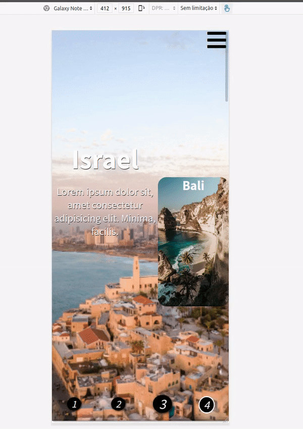
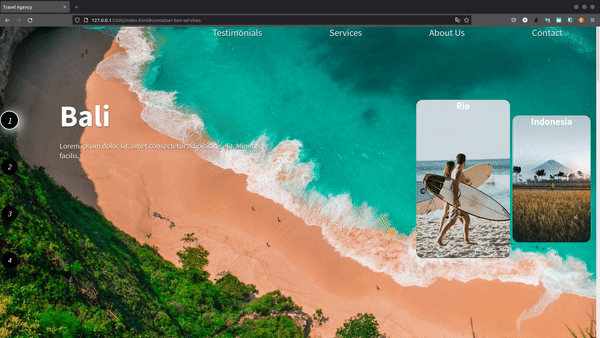
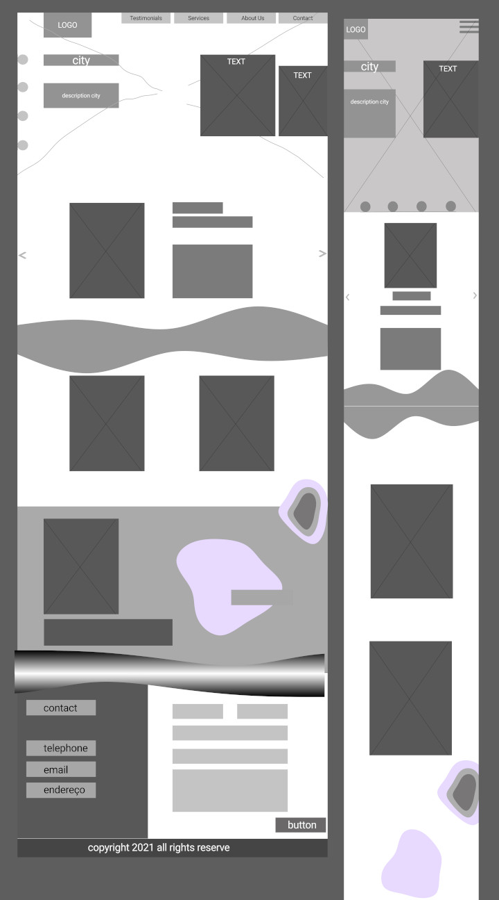
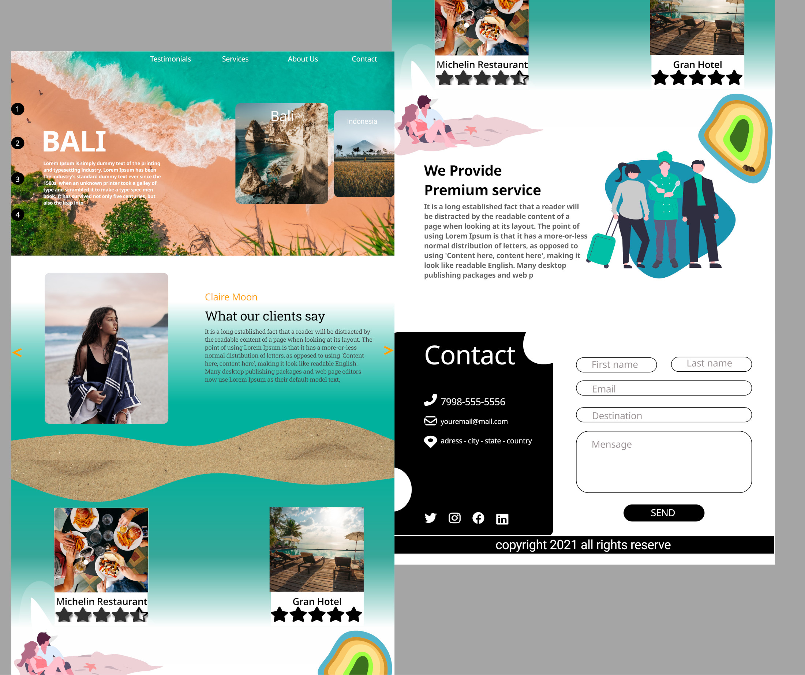
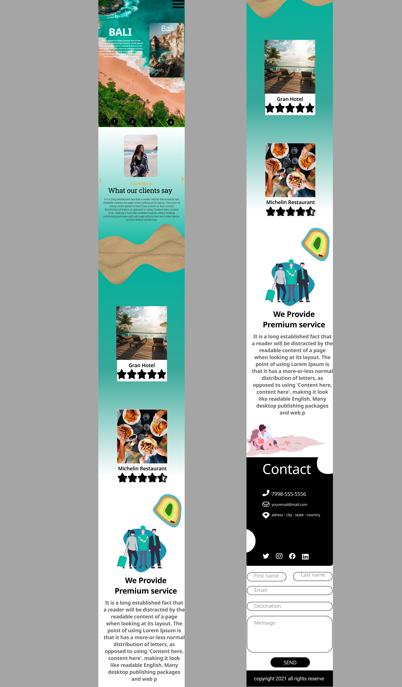

  <h1>Landing Page Travel agency</h1>
  
  <h4>Languages used 

</h4>
   
  <h4>Final Product</h4>
  <h5>MOBILE</h5>
  <code></code>  
  <h5>DESKTOP</h5>
  <code></code>
  <h5>TABLETS</h5>
  <code></code>  
  
  <h4>MOCKUP </h4> 
  <h5><a href="https://dribbble.com/rodrigodev42" target="_blank">check my dribbble</a></h5>
  <h5>WIREFRAME</h5>
  <code></code>  
  <h5>FINAL PRODUCT</h5>
  <code></code>  
  <code></code>   
  

### Contributing
1. Fork it!
2. Create your feature branch: `git checkout -b my-new-feature`
3. Commit your changes: `git commit -am 'Add some feature'`
4. Push to the branch: `git push origin my-new-feature`
5. Submit a pull request :D

